# Zoomer Challenge - Reverse Engineering & Model Inversion Attack

This repository demonstrates a reverse-engineering-assisted white-box model inversion attack against an authentication system. Given only a compiled executable, the task was to extract 18 authorized samples a machine learning model was trained on. This challenge was conducted as a competition among 18 teams as part of the project "[RAID - Reproducing AI Attacks and Defenses](https://raid-international.org/)" at TU Berlin.

## Key Features
- **Reverse Engineering**: Extraction of the model weights and architecture from the binary. Static analysis using Ghidra was performed to write the extraction script.
- **DeepInversion**: Reconstruction of training data from the extracted model by exploiting BatchNorm statistics.
- **Adaptive DeepInversion**: Parallel training of a student model on synthesized images and computing competition loss between student and teacher to encourage broader coverage of the training data.
- **Multi-Resolution Synthesis**: Acceleration of synthesis by optimizing the image at one-quarter of the resolution for the first 50% of iterations, then upscaling to full resolution..

## Competition Result

We achieved the 3rd place out of 18 teams.

| Competitor | Cosine Similarity |
|--------|-------------------|
| Baseline | 0.664 |
| 5th place | 0.705 |
| 4th place | 0.753 |
| Our approach (3rd place) | **0.767** |
| Badge threshold | 0.838 |
| 2nd place | 0.853 |
| 1st place | 0.856 |

## Generated Images

Optimizing for class 0 produced images containing animal features (fur, eyes, feathers) as well as parts of vehicles, likely reflecting ImageNet pretraining. Abstract images with less fine detail achieved the highest cosine similarity of 0.767.
 
<p float="left">
  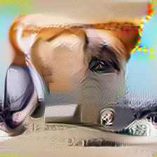
  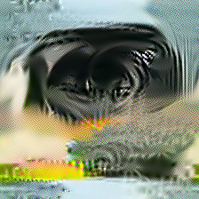
  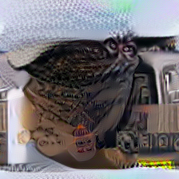
  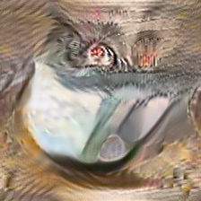
</p>

<p float="left">
  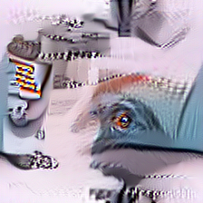
  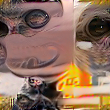
  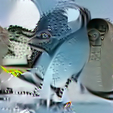
  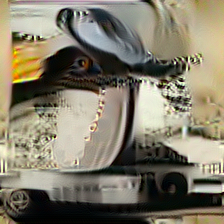
</p>

<p float="left">
  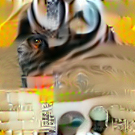
  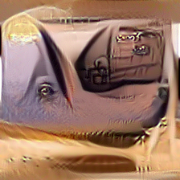
  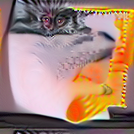
  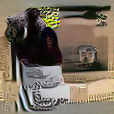
</p>

*More synthesized samples are provided in the `assets` folder.*


## Setup & Installation
 
```bash
pip install torch torchvision numpy matplotlib
```

## References
 
- Yin et al., *Dreaming to Distill: Data-Free Knowledge Transfer via DeepInversion*, [CVPR 2020](https://openaccess.thecvf.com/content_CVPR_2020/html/Yin_Dreaming_to_Distill_Data-Free_Knowledge_Transfer_via_DeepInversion_CVPR_2020_paper.html).
- [Full technical report](report.md)